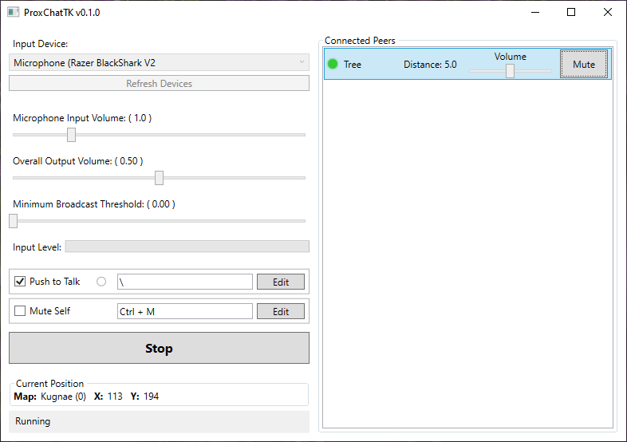

# ProxChatTK

This program captures character location from the NexusTK client and uses it to provide a webrtc-based proximity voice chat.

Project Components:

- Rust signalling server for introducing peers and negotiating webrtc connections
- C#/dotnet desktop application to provide the voice chat
- Dll to pull the character location information from the NexusTK client

## Contributing

This project is pure slop but go for it

I promise to maintain this exactly as much as NTK is maintained

## Download

Find the latest release [here](https://github.com/Ananym/proxchat-tk/releases)

You want the zip file, other files are for the autoupdater.

## User Guide

### Setup:

This application requires the .NET 9 runtime. Get it here (win x64): https://dotnet.microsoft.com/en-us/download/dotnet/thank-you/runtime-desktop-9.0.5-windows-x64-installer

Copy the VERSION.dll into the same directory as NexusTK.exe (probably C:\Program Files (x86)\Kru\NexusTK).
This dll exposes your character name, map name and map id, and x and y co-ordinates to the ProxChat client.

Copy the ProxChatTK folder to a location of your choosing.

The ProxChat client will alert you if an update is available for automatic download and install.
If VERSION.dll ever needs updating, like if we ever got a client update (jk), that will need a manual redownload.

I'm not paying for codesigning certs - expect smartscreen warnings.

### Usage:

Run NexusTK and log into a character, then run the ProxChat client and check that your position is being read successfully.
Click start to connect to the signalling server, then walk near other Proxchat users to begin chatting.

### Bear in mind:

The signalling server is only used to introduce peers - all audio is direct peer to peer.
This means I'm not paying for that bandwidth and I can't access anything you say whatsoever.

However, since we're not using any relay servers, the peer to peer connections will not work on every network type - this application is unlikely to work behind e.g. corporate or hotel networks that use symmetric NAT.
Additionally, as there is no remote multiplexing, connecting to many peers means decoding many incoming audio streams simultaneously. Weak hardware might struggle with this!

Character names are shared between peers for display in the UI, but are never sent to the signalling server.  
All ids are random and temporary - there shouldn't be any way for me or any peers to determine your alts from this application.

As I can't access any transferred audio nor track users, there's no way to police this. Please be polite!
